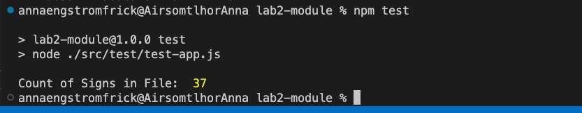
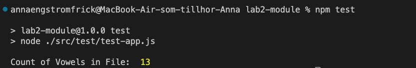
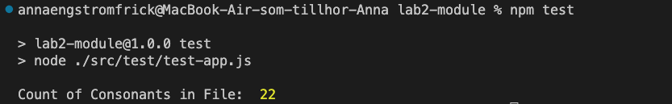
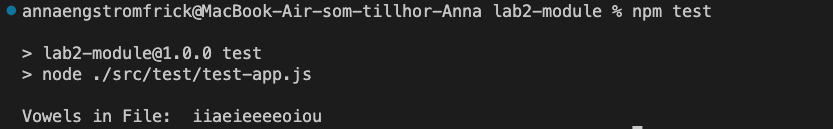
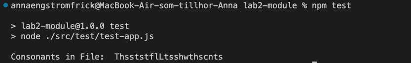
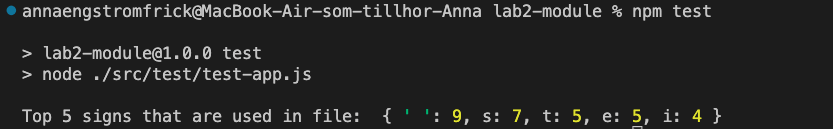
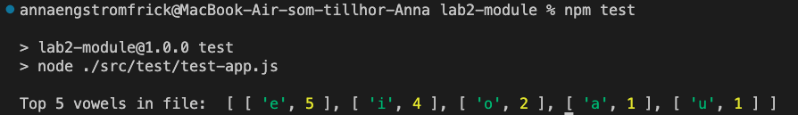
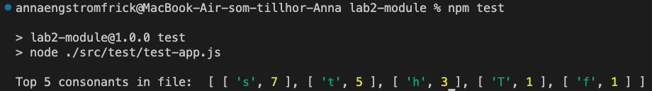

# Test Report of module

## Test report for TC1

**Results**
The results of the test are as follows:
`37`

**Status**
The test passed.

**Comments**

**Test Date and Author**

- Test Date: September 25, 2023
- Author: Anna Engström Frick

## Test report for TC2

**Results**
The results of the test are as follows:
`13`

**Status**
The test passed.

**Comments**

**Test Date and Author**

- Test Date: September 25, 2023
- Author: Anna Engström Frick

## Test report for TC3

**Results**
The results of the test are as follows:
`22`

**Status**
The test passed.

**Comments**

**Test Date and Author**

- Test Date: September 25, 2023
- Author: Anna Engström Frick

## Test report for TC4

**Results**
The results of the test are as follows:
`iiaeieeeeoiou`

**Status**
The test passed.

**Comments**

**Test Date and Author**

- Test Date: September 25, 2023
- Author: Anna Engström Frick

## Test report for TC5

**Results**
The results of the test are as follows:
`ThsststflLtsshwthscnts`

**Status**
The test passed.

**Comments**
The expected output was only with lower case letters while the results was mixed with in lower and upper case letters.

**Test Date and Author**

- Test Date: September 25, 2023
- Author: Anna Engström Frick

## Test report for TC6

**Results**
The results of the test are as follows:
`{ ' ': 9, s: 7, t: 5, e: 5, i: 4 }`

**Status**
The test failed.

**Comments**
The expected output did not include the space sign. The space sign was included in the results. The results was in an object while the expected output wasn't.

**Test Date and Author**

- Test Date: September 25, 2023
- Author: Anna Engström Frick

## Test report for TC7

**Results**
The results of the test are as follows:
` [ [ 'e', 5 ], [ 'i', 4 ], [ 'o', 2 ], [ 'a', 1 ], [ 'u', 1 ] ]`

**Status**
The test passed.

**Comments**
The results was in an array of arrays while the expected output wasn't. But the order of the top five vowels was correct.

**Test Date and Author**

- Test Date: September 25, 2023
- Author: Anna Engström Frick

## Test report for TC8

**Results**
The results of the test are as follows:
`[ [ 's', 7 ], [ 't', 5 ], [ 'h', 3 ], [ 'T', 1 ], [ 'f', 1 ] ]`

**Status**
The test failed.

**Comments**
The results didn't match the expected output. The lower case and upper case of the letter `t` was not counted together. The results was in an array of arrays while the expected output wasn't.

**Test Date and Author**

- Test Date: September 25, 2023
- Author: Anna Engström Frick
